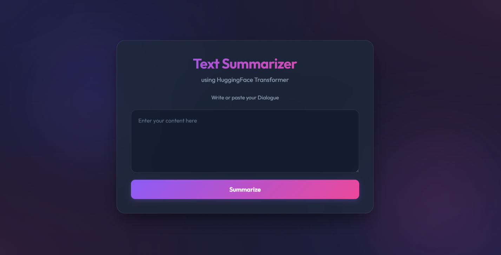
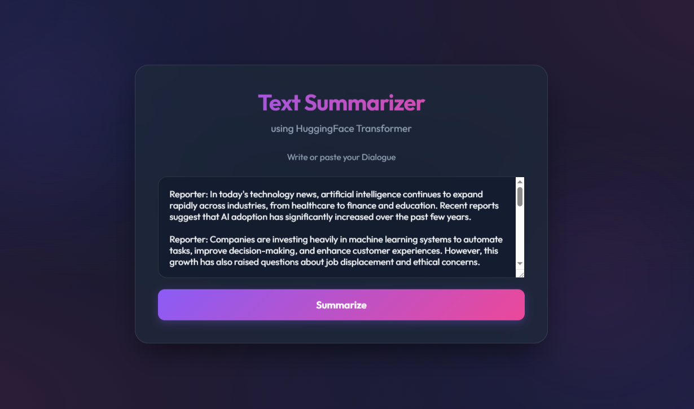
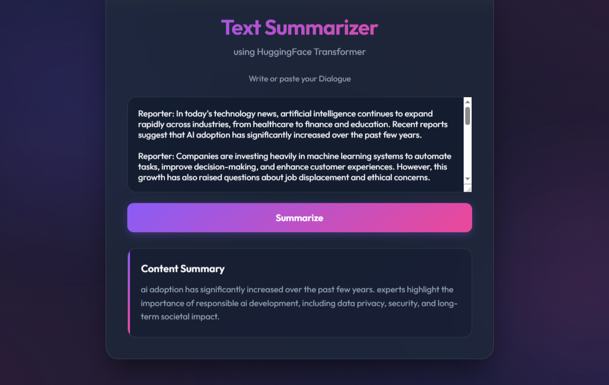

# 📝 Dialogue Summarization using T5

A Transformer-based dialogue summarization web application built with **FastAPI**, **PyTorch**, and **Hugging Face Transformers**. The application uses a fine-tuned **T5 (Text-to-Text Transfer Transformer)** model trained on the **SAMSum** dataset to generate concise summaries from conversational text.

---

## 🚀 Features

- 🤖 Dialogue summarization using a fine-tuned T5 model
- 🌐 FastAPI backend for efficient inference
- 💻 Simple and user-friendly web interface
- 📄 Generates concise summaries from lengthy conversations
- ⚡ Supports CPU, CUDA, and Apple MPS devices
- 🧹 Automatic text preprocessing before summarization

---

## 🛠️ Tech Stack

- Python
- FastAPI
- PyTorch
- Hugging Face Transformers
- T5
- Jinja2
- HTML/CSS
- Regular Expressions (Regex)

---

## 📂 Project Structure

```
dialogue-summarization-t5/
│
├── app.py
├── requirements.txt
├── README.md
├── .gitignore
│
├── templates/
│   └── index.html
│
├── notebooks/
│   └── t5-text-summarizer.ipynb
│
├── screenshots/
│   ├── home.png
│   ├── input.png
│   └── output.png
│
└── saved_summary_models/
```

---

## 📊 Dataset

This project uses the **SAMSum** dataset, a benchmark dataset for dialogue summarization consisting of thousands of messenger-style conversations paired with human-written summaries.

---

## 🧠 Model

- **Architecture:** T5 (Text-to-Text Transfer Transformer)
- **Task:** Abstractive Dialogue Summarization
- **Framework:** Hugging Face Transformers
- **Training Framework:** PyTorch
- **Inference Backend:** FastAPI

---

## ⚙️ Installation

Clone the repository:

```bash
git clone https://github.com/jayeesh729/dialogue-summarization-t5.git
cd dialogue-summarization-t5
```

Install the required dependencies:

```bash
pip install -r requirements.txt
```

---

## ▶️ Running the Application

Start the FastAPI server:

```bash
uvicorn app:app --reload
```

Open your browser and visit:

```
http://127.0.0.1:8000
```

---

## 📸 Screenshots

### Home Page



### Input Dialogue



### Generated Summary



---

## 📝 Example

### Input

```
Alice: Are you coming to the meeting today?
Bob: Yes, I'll be there in 10 minutes.
Alice: Great! Don't forget to bring the project report.
Bob: Sure, I have it with me.
```

### Generated Summary

```
Bob will attend the meeting in 10 minutes and will bring the project report.
```

---

## 📦 Trained Model

The trained model is **not included** in this repository because it exceeds GitHub's file size limit.

After training, save the model locally using:

```python
model.save_pretrained("saved_summary_models")
tokenizer.save_pretrained("saved_summary_models")
```

Place the downloaded or trained model inside:

```
saved_summary_models/
```

---

## 🔮 Future Improvements

- Deploy the application using Docker
- Support larger Transformer models (T5-Base, BART, PEGASUS)
- Add REST API documentation with Swagger
- Deploy on Hugging Face Spaces or Render
- Batch summarization support
- Model quantization for faster inference

---

## 👨‍💻 Author

**Jayeesh Vasantha Kumar**

- GitHub: https://github.com/jayeesh729
- LinkedIn: www.linkedin.com/in/jayeessh-vasantha-kumar-49709a301

---

⭐ If you found this project useful, consider giving it a star!
